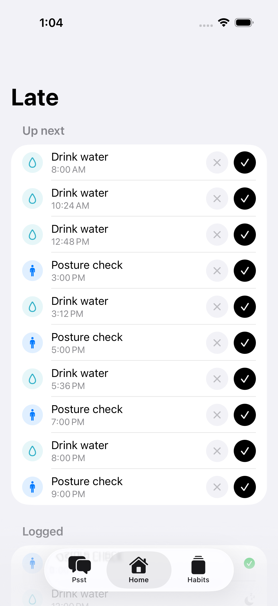
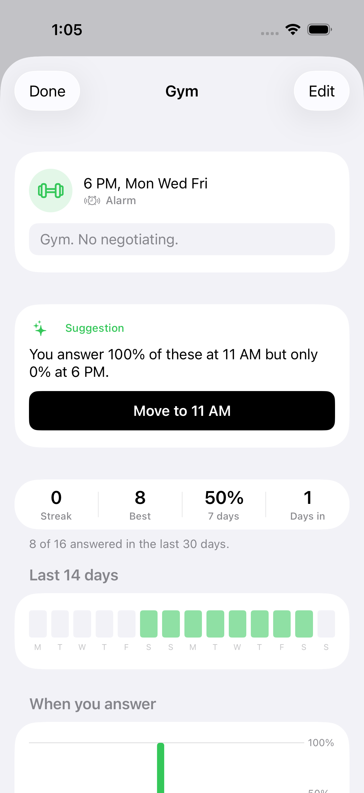
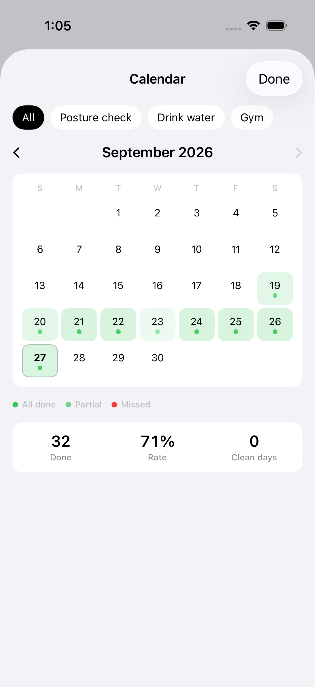

# Psst

An accountability app where the notifications are the product: they arrive at
the right moment, in your own words, and take one tap to answer.

  

## Why it exists

Most habit apps put a checklist behind an app icon you have to remember to
open. Psst inverts that. A habit is a notification schedule, and every surface
in the app exists to make answering that notification take one tap from wherever
you already are: the Lock Screen, the Home Screen, the Action button.

## The three notification tiers

This is the core design, and it is not cosmetic. Each tier is a different iOS
API with a different system budget.

| Tier | API | Buttons without long press | Breaks Focus + silent | Budget |
|---|---|---|---|---|
| `gentle` | `UNNotificationRequest` | no | no | 64 pending, shared |
| `standard` | ActivityKit Live Activity | yes, on Lock Screen | no | undocumented, assume tiny |
| `alarm` | AlarmKit (iOS 26+) | yes, always | yes | `maximumLimitReached` |

Constraints that shape everything:

- **64 pending local notification requests, app-wide, system enforced.** No
  workaround. Confirmed by Apple DTS:
  <https://developer.apple.com/forums/thread/811171>. The scheduler keeps a
  rolling 48 hour window and allocates fairly, so one every-15-minutes habit
  cannot starve a once-a-day habit.
- **Notification action buttons need a long press** and only the first two
  render. No public API changes this. That is the entire reason the `standard`
  tier exists.
- **Live Activity concurrency is undocumented.** A refusal is treated as
  routine and those nudges degrade to plain notifications.
- **AlarmKit recurs natively**, so a weekday 7am habit is one alarm rather than
  one request per day, and it never touches the 64-slot budget.

## Features

- Three intensity tiers, chosen per habit
- Interval, fixed-time, and X-per-day/week/month schedules with minute precision
- An assistant you talk to in plain language that can do anything you can do in
  the app, with a confirmation gate on anything destructive
- Adaptive suggestions derived from when you actually answer, not when you said
  you would
- Habit detail with streaks, a 14 day strip, and a time-of-day chart
- Month calendar, weekly review, Home Screen widget, and an Action button control
- Snooze that actually brings the nudge back, capped at three

## Running it

Requires Xcode 26.1+ and an iOS 26 device. Live Activities and AlarmKit cannot
be exercised in the simulator.

```sh
cd ios
xcodegen generate          # the .xcodeproj is generated, not committed
open Psst.xcodeproj
```

Tests:

```sh
xcodebuild test -scheme Psst -destination 'platform=iOS Simulator,name=iPhone 17'
```

Seeded UI, so you do not have to tap through setup:

```sh
SIMCTL_CHILD_PSST_SEED=1 xcrun simctl launch booted com.connorsweeney.Psst
```

## The assistant

A Cloudflare Worker holds the API key and the conversation. It is provider
agnostic: Anthropic plus any OpenAI-compatible endpoint (OpenRouter, Fireworks,
DeepSeek, Groq, OpenAI).

```sh
cd worker
npm install
npx wrangler secret put OPENROUTER_API_KEY
npx wrangler deploy
```

`MODEL_CHAIN` is an ordered list of `provider:model` tried in turn. Escalation
is driven by observed failure, never by predicting difficulty: a transport
error, unparseable tool arguments, every tool call failing validation, or an
empty response. A 4xx that is our own fault does not escalate, because the next
model would receive the same malformed request.

Models were chosen by measurement, not vibes:

```sh
bun run eval                                       # score the deployed chain
bun run eval openrouter:deepseek/deepseek-v4-pro   # score one model
```

The harness runs real phrasings and checks the resulting mutations, including
the cases that separate models: a floor that must not be undercut, a compound
request that needs two tool calls, a vague complaint that should be answered
with a question rather than a guess.

## Layout

```
ios/Shared/          compiled into BOTH the app and the widget extension
  Types/             pure data: Schedule, Intensity, SwiftData models
  Intents/           App Intents for the Lock Screen and Action button
  Services/          the scheduler, follow-ups, Live Activity control
ios/Psst/
  Design/Theme.swift one vocabulary for colour, type, spacing, motion
  Services/          one per iOS subsystem, plus the coordinator
  Views/
ios/PsstWidgets/     Live Activity, Home Screen widget, Control Center control
worker/              Cloudflare Worker, D1, model routing, eval harness
board/               kanban as folders
```

`CONTEXT.md` holds the code map, the traps, and the decisions not worth
relitigating. Read it before changing the scheduler.

## Style

Explicit dependency injection, errors returned rather than thrown, types
separate from services, and resource lifecycle owned by the entrypoint.
